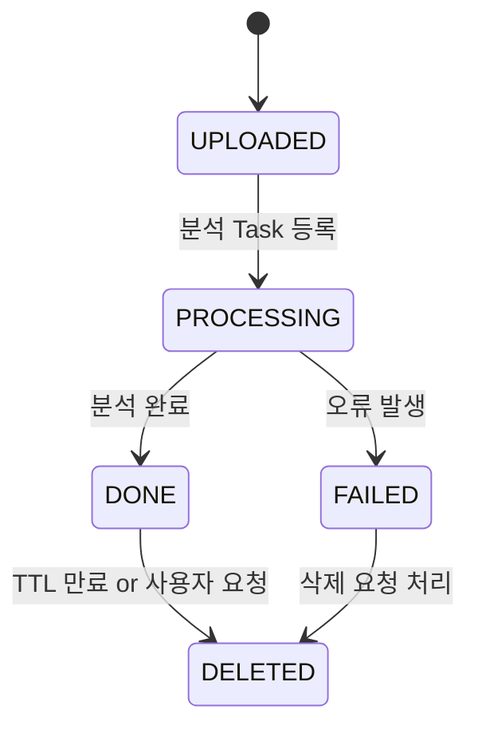

# 전세사기 예방 AI 플랫폼 — 시스템 실행 순서 (System Flow)

> 목적: 웹 서비스의 사용자 요청부터 AI 분석 및 결과 리포트 제공까지의 **전체 실행 흐름**을 정의한다. 이 문서는 프론트엔드와 백엔드 개발자가 공통으로 참조하는 동작 명세서 역할을 한다.

---

## 🧭 1️⃣ 개요

본 시스템은 사용자가 전세계약서를 업로드하면, AI가 자동으로 문서를 분석하여 **위험 조항 하이라이트**, **리스크 점수**, **주의사항 리포트**를 반환한다. 모든 과정은 서버 중심으로 수행되며, 문서 생명주기는 자동 관리된다.

---

## 🧩 2️⃣ 전체 실행 순서 요약 (E2E Flow)

| 단계 | 구성 요소                      | 설명                                                       |
| -- | -------------------------- | -------------------------------------------------------- |
| 1  | **사용자 접속**                 | 웹 클라이언트(React/Next.js)에 접속 → “계약서 분석하기” 버튼 클릭            |
| 2  | **로그인/회원확인**               | 이메일 로그인 or 비회원 접근 허용 (JWT 세션 발급)                         |
| 3  | **업로드 요청 (Presigned URL)** | `/documents/presign` 호출 → S3 업로드용 URL 수신                 |
| 4  | **문서 업로드 (S3)**            | 프론트가 Presigned URL로 S3 `raw/` 폴더에 직접 업로드                 |
| 5  | **파일 메타 등록**               | 업로드 완료 후 `/documents/confirm` API 호출 → 파일 정보 전달 및 등록     |
| 6  | **DB 기록 생성**               | `documents` 테이블에 메타데이터 저장 (`status=UPLOADED`)            |
| 7  | **AI 분석 작업 등록**            | `analysis_request=true` 시 FastAPI Background Task 실행     |
| 8  | **문서 파싱/전처리**              | PDF → 텍스트 추출(pdfplumber) → 정규화/조항 단위 분리                  |
| 9  | **LLM 호출(Lawform AI)**     | GPT 기반 AI가 위험 조항 탐지 및 리포트 생성                             |
| 10 | **결과 후처리**                 | 위험도 점수화 + 설명 라벨링 + JSON 구조화                              |
| 11 | **결과 저장**                  | S3 `results/{document_id}.json` 및 DB(`analyses` 테이블)에 저장 |
| 12 | **결과 요청**                  | 프론트에서 `/results/:document_id` 호출 → JSON 수신               |
| 13 | **리포트 표시(UI)**             | PDF.js로 하이라이트 표시 + 점수 + 위험 항목 리포트 표시                     |
| 14 | **재분석 요청(선택)**             | `/analysis/retry/:document_id` 호출 → 원본 재활용하여 재분석         |
| 15 | **삭제/파기**                  | TTL(3일) or 사용자 요청 시 S3/DB에서 원본 삭제                        |

---

## ⚙️ 3️⃣ 데이터 흐름 다이어그램

```mermaid
flowchart LR
A[사용자 브라우저] -->|파일 업로드 요청| B[FastAPI 서버]
B -->|Presigned PUT 발급| S3[(S3 raw)]
A -->|업로드| S3
A -->|POST /documents/confirm| B
B -->|DB insert| DB[(PostgreSQL)]
B -->|Background Task 등록| W[Worker]
W -->|텍스트 추출+LLM 분석| L[Lawform AI]
L -->|결과 JSON| S3R[(S3 results)]
W -->|DB 업데이트| DB
A -->|결과 조회 /results/:id| B
B -->|결과 반환(JSON)| A
A -->|PDF.js 하이라이트 렌더링| A
B -->|TTL 만료 자동 삭제| S3
```

---

## 📦 4️⃣ 주요 API 연동 순서

| 순서 | API                     | Method   | 주요 데이터                                 | 설명                  |
| -- | ----------------------- | -------- | -------------------------------------- | ------------------- |
| ①  | `/documents/presign`    | `POST`   | `file_name`, `mime_type`, `size_bytes` | S3 Presigned URL 발급 |
| ②  | `S3 Upload`             | `PUT`    | Binary File                            | 사용자가 S3에 직접 업로드     |
| ③  | `/documents/confirm`    | `POST`   | 파일 메타데이터(JSON)                         | DB 등록 및 분석 트리거      |
| ④  | `/analysis/retry/:id`   | `POST`   | `document_id`                          | 재분석 요청              |
| ⑤  | `/results/:id`          | `GET`    | `document_id`                          | 분석 결과(JSON) 반환      |
| ⑥  | `/documents/delete/:id` | `DELETE` | `document_id`                          | S3 + DB 데이터 삭제      |

---

## 🧠 5️⃣ 상태 전이(State Machine)



---

## 🔄 6️⃣ 예외 흐름 (재분석 및 오류)

| 상황                | 처리 방식                                  |
| ----------------- | -------------------------------------- |
| Lawform 응답 실패     | Retry 최대 3회 → 실패 시 `status=FAILED`     |
| 후처리 오류(JSON 불일치)  | Fallback to Rule-based Parser          |
| S3 원본 만료 후 재분석 요청 | 사용자 재업로드 필요 (해시 일치 시 동일 문서로 처리)        |
| 사용자 삭제 요청         | `/documents/delete` 호출 시 즉시 삭제 및 로그 기록 |

---

## 🔐 7️⃣ 생명주기(Lifecycle) 관리

| 경로                | 보존기간 | 자동 삭제 | 설명             |
| ----------------- | ---- | ----- | -------------- |
| `S3/raw/*`        | 3일   | ✅     | Lawform 분석용 원본 |
| `S3/results/*`    | 90일  | ✅     | AI 분석 결과       |
| `S3/quarantine/*` | 7일   | ✅     | 바이러스 스캔 대기     |

> FastAPI는 `DELETE /documents/:id` 호출 시 즉시 삭제를 수행하며, S3 Lifecycle Rule에 의해 자동 파기도 병행된다.

---

## 📊 8️⃣ 데이터 저장 요약

| 저장소                   | 내용                             | 설명                |
| --------------------- | ------------------------------ | ----------------- |
| **S3**                | 원본(raw), 결과(results), 로그(logs) | 파일 스토리지           |
| **PostgreSQL**        | 문서 메타, 분석 결과, 로그               | 관계형 데이터           |
| **Redis (선택)**        | 임시 큐/캐시                        | 비동기 처리 및 세션       |
| **LocalStorage (FE)** | 진행상태/파일명 캐시                    | UX 향상용 (원본 저장 금지) |

---

## 🧾 9️⃣ 사용자 입장에서의 실행 흐름 요약

1️⃣ 로그인 후 “계약서 분석하기” 클릭
2️⃣ 계약서 PDF 선택 → 업로드 완료 알림
3️⃣ AI 분석 진행 중 로딩 표시
4️⃣ 완료 후 결과 리포트 표시 (점수, 위험 조항, 외부 링크)
5️⃣ 필요 시 “재분석 요청” 클릭
6️⃣ 사용 종료 시 “문서 삭제” 또는 자동 파기

---

> 📘 **요약:**  이 시스템은 **프론트엔드가 사용자 경험(UI)** 을 담당하고, **백엔드가 데이터 관리·AI 분석·보안 통제**를 수행한다. 모든 문서의 흐름은 서버 중심으로 관리되며, 각 단계의 상태는 `documents.status` 필드로 추적된다.
